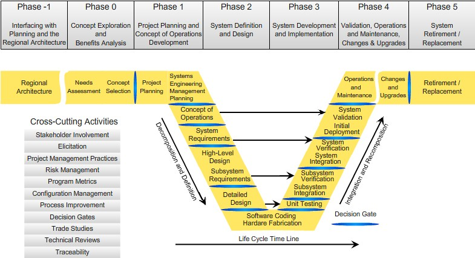
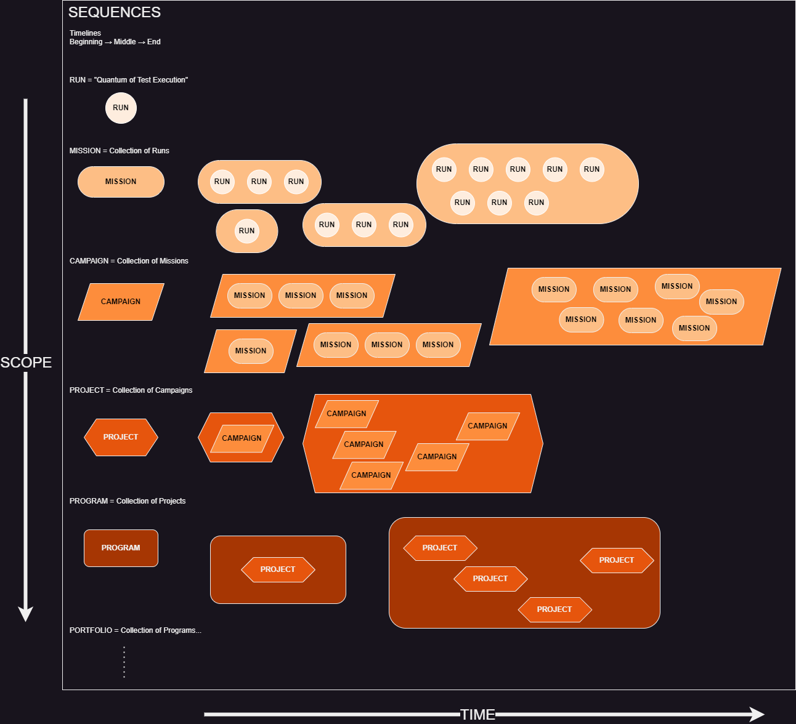

# PPEAR aka The Test Process

## The Systems Engineering "V"


*The Systems Engineering "V"*

The Systems Engineering "V" is very powerful. It provides a framework for system design-build-test that has enabled space travel.

However, the "V" itself is deceptively simple, and implies a linear sequence of phases, all moving forward in time.

This diagram includes a set of "Cross-Cutting Activities," as well, that occur regardless of phase or level of detail. The "V" provides no insight into how to manage those cross-cutting activities.

## The Test Process

The test process is in many ways analogous to Systems Engineering. Test Engineering can be seen as a design discipline, in which a test is designed.

### PER

| Systems Engineering | Test Engineering |
| ------------- | ------------- |
| Decomposition and Definition - Requirements | Plan: Objectives and Measures of Performance  |
| Develop and Implement - Software Coding and Hardware Fabrication  | Execute: Conduct Test  |
| Integration and Recomposition - Verification | Report: Results and Recommendations |

Often these steps are seen as a simple sequence.

```{mermaid}
flowchart LR
    Plan --> Execute
    Execute --> Report
```

However, a plan is only a concept, and execution requires some preparation. Also, execution generates data, but data alone isn't sufficient for reporting.

## PPEAR

By inserting two more steps, a complete set emerges.

```{mermaid}
flowchart LR
    Plan --> Provision
    Provision --> Execute
    Execute --> Analyze
    Analyze --> Report
```

### Plan

Planning is the activity that takes hypotheses and system requirements and translates them into test requirements.


*Plan Translates Test Objectives into Test Points*

The fundamental unit of test planning is a Test Point.

A Test Point is the unique combination of Test Methodology and Test Condition that generates the data required to satisfy test objectives.

### Provision

Provisioning is the activity that takes test requirements and translates them into test resources necessary and sufficient to execute test.


*Provision Translates Test Requirements into Test Resources*

The fundamental unit of test provisioning is a Test Card.

A Test Card is the unique combination of Test Point(s), Test Resources (People/Places/Things/Communication), and executable steps for Setup/Procedure/Recovery.

### Execute

Execution is the activity that takes test cards and translates them into test runs executed on a timeline.

*Execution Figure Still WIP*

The fundamental unit of test execution is a Test Run.

A Test Run is the unique combination of start time, end time, attempted Test Card, actual Test Team, and the Test Dataset associated with the execution.

### Analyze

Analysis is the activity that takes test runs and translates them into test results.

*Analysis Figure Still WIP*

The fundamental unit of test analysis is a Test Result.

A Test Result is the unique combination of narrative, data product(s), and context that answers a particular question.

### Report

Reporting is the activity that takes test results and translates them into recommendations for action.

*Reporting Figure Still WIP"

The fundamental unit of test reporting is a Test Recommendation.

A Test Recommendation is the unique combination of test result, mission impact, professional assessment, and timing.

## Constraints

Constraints are the bounds of action and possibility.


*Constraints are the Boundaries Within Which Test Occurs*

Constraints can be mapped to the classic "Safe, Secure, Effective, Efficient."

Constraints can be expressed in multiple formats.

Not all constraints are created equal.

## Complexity

That all sounds simple enough, but the figure below shows that the Test Process is not as simple as a 5-step linear progression in time.

Every aspect of PPEAR literally affects every other, and as one moves through the process, revelations occur almost constantly that drive forward and backward updates and iterations.

```{mermaid}
---
title: "Interactions Between Process Components"
---
%%{init: {"flowchart": {"htmlLabels": false}} }%%
flowchart LR
    subgraph Constraints
        direction LR
        Plan["`**Plan**
        *Requirements*`"]
        Provision["`**Provision**
        *Resources*`"]
        Execute["`**Execute**
        *Runs*`"]
        Analyze["`**Analyze**
        *Results*`"]
        Report["`**Report**
        *Recommendations*`"]
        Plan --> Provision 
        Plan --> Execute
        Plan --> Analyze
        Plan --> Report
        Provision --> Execute
        Provision --> Analyze
        Provision --> Report
        Provision -.-> Plan
        Execute --> Analyze
        Execute --> Report
        Execute -.-> Provision
        Execute -.-> Plan
        Analyze --> Report
        Analyze -.-> Execute
        Analyze -.-> Provision
        Analyze -.-> Plan
        Report -.-> Analyze
        Report -.-> Execute
        Report -.-> Provision
        Report -.-> Plan
    end
```

## Sequences

Adding to the complexity of the Test Process is that the web of relationships and entities that is PPEAR must get iteratively mapped to a timeline.

On the timeline are sets of sequences.

A Sequence is a thing bound in time with a beginning, a middle, and an end, bracketed with a start time and an end time.

```{mermaid}
---
title: Sequences have a Beginning, a Middle, and an End Bounded by a Start Time and an End Time
---
flowchart LR
    start(["Start Time"]) --> Beginning --> Middle --> End --> stop(["Stop Time"])

```

There are sequences at multiple nested layers, as well.



### Run

The smallest sequence is a Run, from the Execution step. The Run's beginning is called Setup, its middle is Procedure, and its End is Recovery.

### Mission

The next level of Sequence is a Mission. A Mission consists of one or more Runs, which could be executed in serial and/or parallel. The Mission's beginning is called Brief, its middle is called Test, and its End is Debrief.

### Campaign

The next level is Campaign. A Campaign consists of one or more Missions, serial and/or parallel. The Campaign's beginning is called ???, its middle is ???, and its End is ???.

### Project

The next level is Project. A Project consists of one or more Campaigns, serial and/or parallel. The Project's beginning is called ???, its middle is ???, and its End is ???.

### Program

The next level is Program. A Program consists of one or more Projects, serial and/or parallel. The Program's beginning is called ???, its middle is ???, and its end is ???.

### Portfolio

The next level is Portfolio. A Portfolio consists of one or more Programs, serial and/or parallel. The Portfolio's beginning is called ???, its middle is ???, and its end is ???.

The next level is ???....